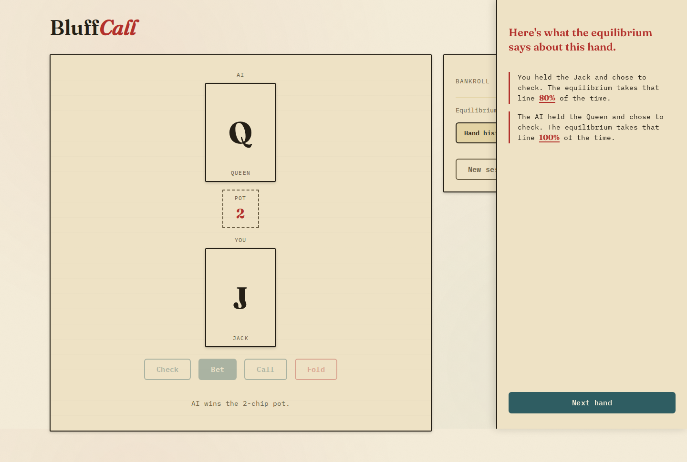

# Bluff Call

A single-player bluffing game against an AI that plays the mathematically **solved**
optimal strategy for Kuhn poker. Lose a hand to a well-timed bluff, then see the
reveal: the exact Nash-equilibrium frequency the AI (or you) should have bluffed or
folded with that card, and why.

## Why

Most "AI" poker opponents are heuristics or trained bots — you can beat them, but you
can never be sure the coaching after a hand is actually correct. Kuhn poker (Kuhn,
1950) is small enough that its Nash equilibrium is fully solved in closed form. Bluff
Call plays that exact equilibrium and shows you the real numbers after every hand:
"the GTO-optimal move here was to bluff 33% of the time with this card — here's why."
No approximation, no heuristic bot's guess.

## How it works

- **The game**: Kuhn poker — a 3-card deck (Jack, Queen, King), one card each, one
  round of check/bet/call/fold betting, played to a running bankroll.
- **The opponent**: implements the published equilibrium strategy (parameterized by a
  single bluffing frequency `α`), not a trained or heuristic model.
- **The reveal**: after every hand, an annotated breakdown shows the equilibrium
  action and frequency for the cards involved, and how your actual decision compared.



### One hand, start to finish

1. You are dealt one of three cards and act first: check or bet.
2. The AI responds by sampling the solved equilibrium for its hidden card.
3. If a bet is made, the other player chooses call or fold; otherwise the higher card
   wins at showdown.
4. The bankroll, hand history, and equilibrium-accuracy ledger update.
5. The margin proof opens with every decision from that hand and its exact GTO
   frequency, then **Next hand** deals again.

## Stack

- TypeScript, built with [Vite](https://vitejs.dev/)
- [Vitest](https://vitest.dev/) for unit tests (game rules + solver correctness)
- Static, self-contained output — no server, no backend, no binary assets

## Status

Playable end to end: deal, bet/check/call/fold, AI sampled from the real equilibrium,
bankroll, hand history, and the margin-proof reveal. See
[`docs/VISION.md`](docs/VISION.md) for the product plan, [`docs/BACKLOG.md`](docs/BACKLOG.md)
for the story-level build breakdown, and [`docs/ARCHITECTURE.md`](docs/ARCHITECTURE.md) for
how the modules fit together.

## Development

```bash
npm install
npm run dev      # local dev server
npm test         # run the test suite
npm run build    # production build to dist/
```

Add `?seed=<number>` to the dev URL to make dealing and AI actions deterministic — useful
for manually reaching a specific line (e.g. a bluff) while testing.

## License

MIT — see [LICENSE](LICENSE).
